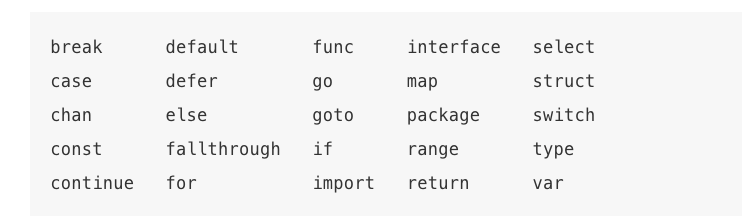
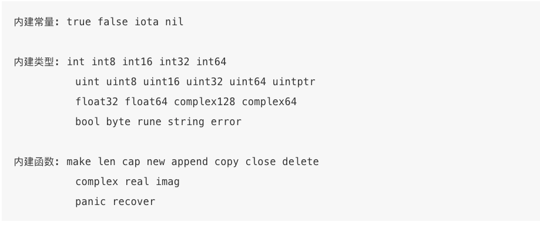

# 2.1 命名
## 命名规则
* 建议使用短小的名字
* 推荐使用驼峰
* 缩略词采用全大写  
* go语言中函数名、变量名、常量名、语句标号和包名等命名遵守以下规则
    * 以字母或下滑线开头
    * 区分大小写
    * 不能使用关键字
    
    内部预定义名字可以重定义  
    
## 可见性
* 在函数内定义，则在函数内有效
* 在函数外定义
    * 包中所有文件可访问
    * 名字首字母大写（包括方法），public，包外可访问（fmt包的Printf函）
    * 名字首字母小写，包外不可访问
  
# 2.2声明
* 声明语句定义了程序的各种实体对象以及部分或全部属性
* Go语言的四种声明语句
  * var 变量
  * const 常量
  * type 类型
  * func 函数实体
* .go文件组成
  * 包声明语句 package main
  * import导入其他包 import "fmt"
  * 包一级的类型、变量、常量、函数的声明语
* 函数定义 从第一句话执行到结尾或者return语句
  * func关键字
  * 函数名称
  * 参数列表
  * 返回值列表 可省略
  * 函数体
  
# **2.3变量**
## 基本概念
* 不存在未初始化的变量 可以直接使用
* var语句可以创建特定类型变量
* var 变量名字 类型 = 表达式
  * 省略类型 根据表达式推断变量类型
    * var 变量名字 = 表达式
  * 省略 = 表达式 设置为对应的零值
    * var 变量名字 类型
* 同时声明一组变量
  * 用一组初始化表达式
    * var i, j, k int
  * 省略每个变量类型
    * var b, f, z = true, 2.3, "four"
* 可以通过一个函数完成多个返回值初始化
  * var f, err = os.Open(name) 
* 初始化时机
  * 包级声明会在main入口前执行
  * 局部变量会等到执行时才初始化  
## 简短变量声明
* 简短变量声明语句 名字:=表达式 变量类型根据表达式自动推导
  * t := 0.0
* var与简短变量声明对比
  * var 显式指定变量类型/稍后进行重新赋值
    * var p Point
  * 简短变量声明 广泛用于局部变量的声明和初始化
    * i := 100  
    * f, err := os.Open(name)
* :=与=区别
  * :=是一个变量声明语句
  * =是一个变量赋值操作 
    * i, j = j, i // 交换 i 和 j 的值
* 注意
  * 如果已经声明过的变量，则为重新赋值
  * 简单变量声明中至少包含一个新变量
    * 改用普通的多重赋值语句
    * f, err := os.Open(infile)
    * f, err := os.Create(outfile) // compile error: no new variables
## **指针&**
* 一个变量对应保存了一个该数据类型的内存空间
* 通过指针可以直接读取和更新对应变量的值，不需要知道变量名称  
* 一个指针是另一个变量的地址（内存中的存储位置）（可以声明多个同一变量的指针）
  * 每一个变量都有一个内存地址
  * 不是每一个值都有内存地址
* x := 1 p := &x *p = 2 声明一个x的变量
  * &x（取x变量的内存地址） 指向该变量的指针  指针类型是*int
    * 指向变量x
    * 指针*int类型的指针
  * *p
    * p指针指向的变量的值
    * *p = 2直接修改变量的值
* 聚合类型（结构体子弹、数组元素）对应一个变量，有可取地址 有指针
* 指针间下同
  * 指向同一个变量
  * 全部都是nil

## new函数
* 语法糖
* 每次创建返回一个新的地址  
* 创建变量new(T)
  * 创建并初始化一个T类型的匿名变量
  * 返回变量地址，返回的指针类型为*T
  * 通过*指针进行取值
* 注意 
  * 谨慎使用大小为0的类型，会导致Go语言的自动垃圾回收器有不同的行为
  * 使用极少 一般使用直接创建变量
  * new不是关键字，可以命名new变量，但是无法使用new函数了

## 变量的生命周期
* 包级声明变量生命周期与程序相同
* 局部变量 从创建新变量开始，直到该变量不再被引用为止
* 通过是否可达判断是否回收该变量
* 分配方式
  * 包级变量分配在堆上
    * 注意从变量重栈上逃逸  需要额外分配对象，对性能有细微影响
  * 局部变量分配在栈上
* 根据变量生命周期编写合适的代码

# 2.4赋值
## 赋值语句
* 使用赋值语句可以更新变量值
  * 命名变量的赋值 x = 1
  * 通过指针间接赋值 *p = true
  * 结构体字段赋值 person.name = "bob"
  * 数组、slice或map的元素赋值 count[x] = count[x] * scale
  * 数值变量 v++
## 元祖赋值
* 同时更新多个变量值
* 赋值语句右边表达式进行求值，然后统一赋值给左边
  * x, y = y, x
  * a[i], a[j] = a[j], a[i]
  * 斐波那契  x, y = y, x+y
  * i, j, k = 2, 3, 5
  * 多个返回值函数 f, err = os.Open("foo.txt")
  * map查找 v, ok = m[key]
  * 类型断言 v, ok = x.(T)
  * 通道接收 v, ok = <-ch
* 下划线空白标识符_来丢弃不需要的值
  * _, err = io.Copy(dst, src) 
  * _, ok = x.(T) 
## 可赋值性
* 隐式的赋值行为
  * 函数调用会隐式地将调用参数的值赋值给函数的参数变量
  * 返回语句会隐式地将返回操作的值赋值给结果变量
  * 复合类型的字面量（§4.2）也会产生赋值行为
    * medals := []string{"gold", "silver", "bronze"}
    * medals[0] = "gold"
    * medals[1] = "silver"
    * medals[2] = "bronze"
  
# 类型
* 新的类型名称 
  * 相同的底层结构
  * 底层类型相同也不兼容（新的类型）  
  * type 类型名字 底层类型
  * 相同底层间的可以类型转换  
  * type Celsius float64    // 摄氏温度
  * type Fahrenheit float64 // 华氏温度
* 不同类型间都实现了String()方法  

# 包和文件
* 支持模块化、封装、单独编译和代码重用
* 包的导入路径
  * gopl.io/ch1/helloworld
  * $GOPATH/src/gopl.io/ch1/helloworld 
* 每个包都对应一个独立的名字空间
  * 相同变量名需要添加包名进行区别
* 导出规则
  * 包内文件可以直接访问
  * 首字母大写 包外可用
  * 首字母小写 包外不可用
## 导入包
* 每个包都有一个全局唯一导入路径
* 一个导入路径代表一个目录或多个Go源文件
* 包名一般选择短小的名字
* 没有使用导入的包会造成编译错误
* 使用goimports自动添加和删除包
## 包的初始化
* 编译器顺序进行初始化
  * Go语言构建工具会将go根据文件进行排序
  * 调用编译器编译
* 包级变量
  * 有初始化表达式则用初始化表达式
  * 可以使用特殊的init()初始化函数（不能直接被外部调用）
    * 按init声明顺序自动调用 
* 所有包都在main执行前完成初始化工作

# 作用域
* 有效使用函数和变量的范围
* 作用域！=生命周期
  * 作用域 编译时属性
  * 生命周期 运行时概念
* 句法块&词法块
  * 句法块 
    * 由花括号包含的块
    * 内部声明的名字无法被外界访问
  * 词法块 
    * 未使用代码块显式的包裹起来
    * 存在全局词法块
    * for if switch等词法块
