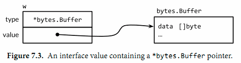

# 概述
* 对其他类型的抽象与概括
* 不具有特定实现细节
* 隐式声明与实现
* 创建新的接口时，满足当下已经存在的类型，而不去改变

# 接口是合约
* 不会暴露对象内部结构和支持的操作
* 具体类型与抽象类型（接口）
  * fmt.Printf  结果写到标准输出
  * fmt.Sprintf 结果以字符串形式返回
  * 面向对象 LSP里式替换

# 接口类型
* 具体描述了一系列方法的集合
* 实现所有方法的具体类型就是这个接口类型的实例
* 声明接口的方式
  * 直接声明方法 通常为单方法
  * 组合接口
  * 混合声明

# 实现接口的条件
* 一个类型拥有一个接口所有dev方法，则实现了该接口
* 通常会将具体类型声明为特定接口类型(接口 与 实体)
  * var w io.Writer = os.Stdout
  * var w io.Writer = new(bytes.Buffer)
  * var rwc io.ReadWriteCloser =  os.Stdout
  * var rwc io.ReadWriteCloser = new(bytes.Buffer)
  * w = rwc
  * rwc = w
* 方法的接收者
  * T  使用T类型调用*T方法是隐式的调用 
    * 语法糖（T方法不拥有*t指针方法）
    * 常量不可以调用
    * 变量可以调用
  * *T
* 只能调用接口暴露的方法 
* interface{}类型 
  * 没有任何方法 
  * 是所有类型的父类
  * 空接口类型
  * 通过类型断言获取interface{}中的值
* 使用括号强转类型
* 使用时新增接口即可 不必修改实现类

# flag.Value接口
* 每一个flag.Value也是一个fmt.Stringer

# 接口值
* 接口
  * 接口的值 动态值
  * 接口值  动态类型 
  
* var w io.Writer
  * 此时为nil
  * 调用任意方法会产生panic

    
* w = os.Stdout
  * 隐式转换
  * io.Writer(os.Stdout) 显式转换 类似强转
  * 动态类型 *os.Stdout
  * 动态值 os.Stdout的拷贝
  * 最终执行等价于 os.Stdout.Write([]byte("hello")) // "hello"

* w = new(bytes.Buffer)
  * 动态类型 *bytes.Buffer
  * 动态值 新分配的缓冲区的指针

  
* w = nil
  * 将所有部分设为nil

    
* 接口值可以通过==或!=进行比较
  * 当接口值都为nil相等
  * 动态值和动态类型相同
  * 接口值可以作为map的键
* 可以使用反射获取接口动态类型的名称 
* 不包含任何值的nil接口值 != 包含nil指针的接口值

# sort.interface接口
* 内置了一些排序函数实现排序功能
* 指定排序算法与排序序列类型的约定
* 需求
  * 序列的长度
  * 表述元素比较结果
  * 交换元素的方式
* reverse通过交换索引改变顺序结果  

# http.Handler接口

# error接口

# 示例:表达式求值

# 类型断言

# 基于类型断言识别错误类型

# 通过类型断言查询接口

# 类型分支

# 示例:基于标记的XML解码

# 补充几点
